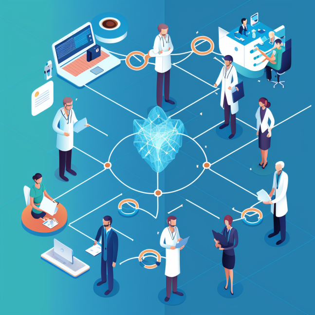

# mential-fhir-standard

### Introduction ###
Monica lives in Spain and has experienced symptoms of anxiety. She has visited several mental health professionals in different primary care centers and hospitals within her autonomous community. Each center uses a different electronic medical record (EMR) system. Monica has received various treatments, such as cognitive-behavioral therapy, medication and group therapy.

For personal reasons, Monica has to move to another autonomous community, which means that she will also have to change doctors and therapists. Without homogeneous mechanisms for recording clinical data, the transfer of medical information between the autonomous communities and the different EMR systems becomes complicated and slow.

Let us now assume that the Spanish healthcare system, all medical centers and professionals, adopt a single language for recording and communicating medical data, a standard such as FHIR. These challenges disappear, bringing numerous advantages:

1. Facilitate the transfer of information: New mental health professionals in the autonomous community to which Monica is moving will be able to easily access her medical records, allowing for better monitoring and treatment of her anxiety symptoms.
2. Improve coordination of care: The different professionals involved in Monica's treatment in both autonomous communities will be able to share and update information about her case, allowing for more integrated and personalized care.
3. Empower the patient: Monica will be able to access her own medical records, allowing her to make more informed decisions about her treatment and track her progress.
4. Save time and resources: By facilitating communication and information transfer between autonomous communities and professionals, FHIR reduces the need for repeated tests and assessments, saving time and resources.

In this context, the FHIR standard is especially useful in the Spanish healthcare system, where the transfer of medical information between different autonomous communities and EMR systems can be a challenge. Adopting FHIR helps to improve patient care by facilitating communication, information transfer and collaboration between professionals across the country.

